# Diagramas de flujo (Mermaid)

Pegar cada bloque (sin las líneas ` ```mermaid ` / ` ``` `) en [mermaid.live](https://mermaid.live) para editar o exportar.

## Flujo de mantenimiento de contenido (editor no técnico)


## Flujo de desarrollo (cambios de código)

```mermaid
flowchart LR
    A["Rama nueva desde dev<br/>(o commit directo en dev<br/>si el cambio es chico)"] --> B["Cambios de código<br/>(.astro, componentes, schema)"]
    B --> C["Verificación local:<br/>npx astro sync<br/>npm run build"]
    C --> D["PR en GitHub<br/>feature → dev"]
    D --> E["Squash & merge"]
    E --> F["Deploy automático de<br/><b>PREVIEW</b><br/>(Cloudflare Workers Builds)"]
    F --> G["Revisar preview"]
    G --> H["PR en GitHub<br/>dev → main"]
    H --> I["Squash & merge"]
    I --> J["Deploy automático de<br/><b>PRODUCCIÓN</b><br/>(Cloudflare Workers Builds)"]
    J --> K(["Live en<br/>site.webfriendschile.workers.dev"])

    classDef step fill:#e2e8f0,stroke:#334155,stroke-width:2px,color:#0f172a
    classDef commit fill:#fcd34d,stroke:#78350f,stroke-width:2px,color:#1c1305
    classDef preview fill:#1d4ed8,stroke:#0f2a7a,stroke-width:2px,color:#ffffff
    classDef prod fill:#047857,stroke:#022c22,stroke-width:2px,color:#ffffff
    classDef live fill:#065f46,stroke:#022c22,stroke-width:2px,color:#ffffff

    class A,B,D,E,G,H,I step
    class C commit
    class F preview
    class J prod
    class K live
```



## Nota

Ambos flujos convergen en el mismo pipeline de revisión (`dev` → `main` con preview automático en el medio) — la diferencia está solo en el origen: contenido nace en la rama `keystatic` vía el panel CMS, código nace en una rama de feature vía edición manual. Ver [`WORKFLOW.md`](../WORKFLOW.md) para el detalle completo y [`README.md`](../README.md) para arquitectura general.
